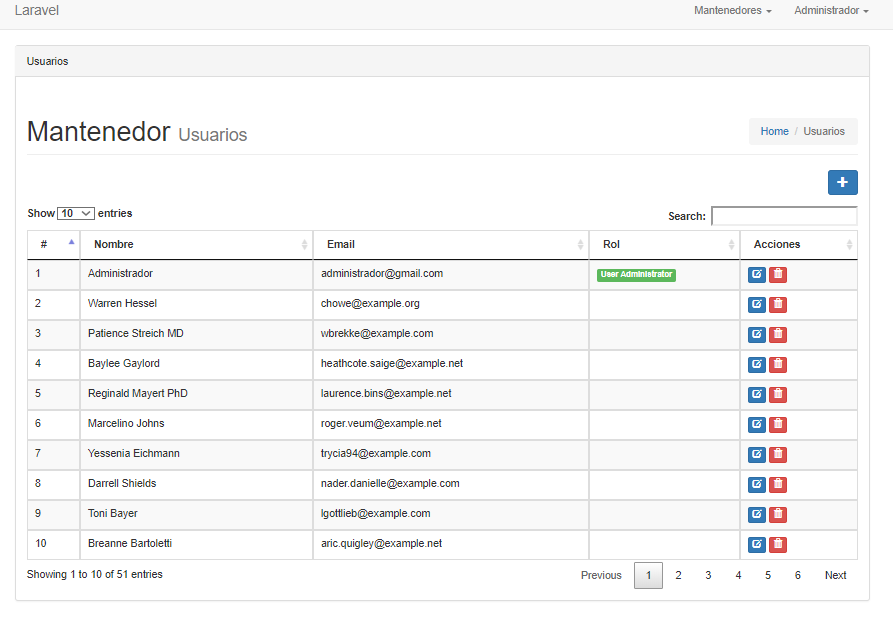

<p align="center"></p>

# laravel-roles-permissions
Base Laravel, Roles and permissions to implement in any project.

>* *Entrust is a succinct and flexible way to add Role-based Permissions to Laravel 5.* [entrust](https://github.com/Zizaco/entrust).

## Install
> *Download repository git*

`https://github.com/nmardones/laravel-roles-permissions.git`

> *or in this way*

* `$ git init`
* `$ git remote add origin https://github.com/nmardones/laravel-roles-permissions.git`
`$ git clone https://gitlab.com/nmardones/base-laravel.git`

> *Or this way*

* `$ git init`
* `$ git remote add origin https://gitlab.com/nmardones/base-laravel.git`

* `$ git pull origin develop`

> *Configuration .env*

```[php]
DB_CONNECTION=mysql
DB_HOST=127.0.0.1
DB_PORT=3306
DB_DATABASE=base-laravel
DB_USERNAME=root
```

```[php]
CACHE_DRIVER=array
```


> *With artisan*

```[php]
$ php artisan migrate
$ php artisan db:seed
```
## Login
>*  `user: administrador@gmail.com`     
>*  `password: 123456`



> *Enjoy!!! ;)*


> *@nmardones*